# Design Tokens with React & Material UI

## Table of Contents

- [Introduction](#introduction)
- [Getting Started](#getting-started)
- [Interaction Overview](#interaction-overview)
- [Material UI Theme Integration](#material-ui-theme-integration)

## Introduction

Design tokens are a way to store and manage visual design attributes (colors, typography, spacing, etc.) in a platform-agnostic and reusable format. They enable consistency and scalability in design systems by centralizing style values, making it easy to update and propagate changes across multiple platforms and products.

This project shows a sample React application that uses design tokens generated using [style-dictionary](https://styledictionary.com/getting-started/installation/). `App.tsx` shows several different ways to style a component, with and without using design tokens.

Refer to https://github.com/pinardy/design-tokens to see how the design tokens are generated and exported.

A detailed explanation of how to customize Material UI components can be found in their official documentation [here](https://mui.com/material-ui/customization/how-to-customize).

## Getting Started

1. Install project dependencies with `npm i`.

2. Run the sample React app with:

```sh
npm run dev
```

## Interaction Overview

```mermaid
flowchart LR
  subgraph design-token package
    A[Designer/Developer updates tokens.jsonc] --> B[Run `npm run build:tokens`]
    B --> C[tokens.ts / tokens.css generated]
    C --> D[Run `npm run build` to generate latest dist folder]
    D --> E[Upgrade package version]
    E --> F[Publish latest package for other projects to import]
  end
  subgraph External Projects
    F --> G[Import updated design-token package]
    G --> H[Material UI ThemeOptions configured in codebase]
    H --> I[ThemeProvider applies theme to components]
    I --> J[Components use theme values for styling]
  end
```



## Material UI Theme Integration

Material UI components are customized using the generated design tokens via the `ThemeOptions` object in `src/theme/themeOptions.ts`. This integration ensures that your UI components consistently use the design system values defined by the designers.

Using `ThemeOptions` allows us to control the styles of your components globally, instead of having developers going into each component to manually override the styles of the component. This approach allows you to update your design tokens and have those changes automatically reflected throughout your Material UI components, ensuring a consistent and maintainable design system.

## Extending Types

To add new custom colors, refer to the official documentation [here](https://mui.com/material-ui/customization/palette/#custom-colors).

A new types file `mui-component-override.d.ts` is added to override the `Button` and `Chip` props to include the `violet` colour as a valid colour. This allows us to pass "violet" in as a colour like this:

```tsx
<Chip label="Chip Color Primary" color="primary" variant="outlined" />
```
